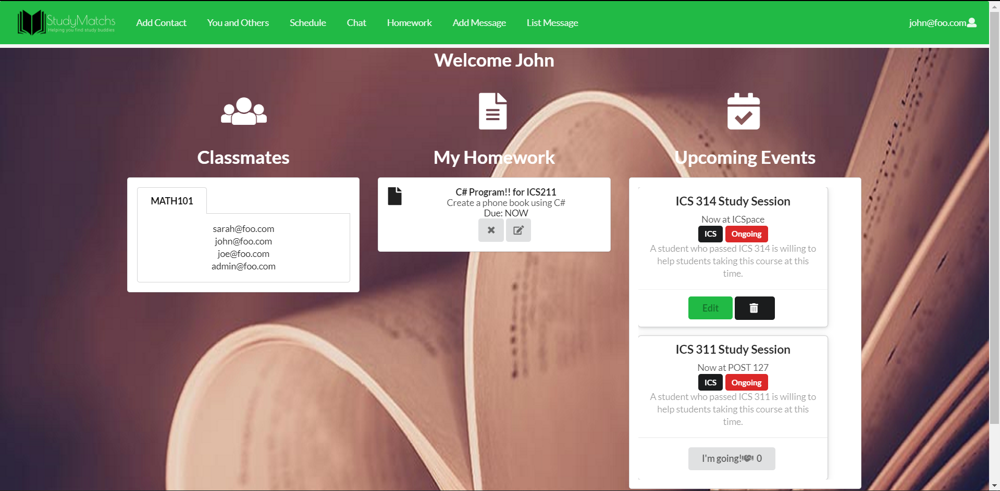

# The More You Know (And Knowing is Half the Battle)

Over the course of this class, while most assignments were in the realm of web application development, I was definitely challenged to lean more and more about programming in general. Every week, I pulled up a song on Youtube, set it on loop, and got to work on the application assignments for the class that week. After listening to the entire Star Wars suite by John Williams, I can honestly say that I learned a lot of software engineering concepts.

## How the Functional Programming Is This Supposed to Work?

In all honesty, most of the programs I made up until this semester did not heavily use functional programming compared to this class. Looking back on it, the functional programming is a lot easier than doing everything manually. As much as I hated having to double-check for some sort of function to make my life easier, it saves a lot of time. If I tried to do everything manually, I would have been unable to finish anything on time. By relegating everything to a function, I managed to avoid screaming expletives at my computer every time the something went wrong.

## American Battleships and Coding Standards

Yeah, that’s right. Back in the day when battleships were the queens of the sea, American battleships were made as Standard-type battleships with a set of requirements:
1.	All-or-Nothing armor (meaning important parts of the ship get more armor while other parts get less)
2.	Main guns only lined up on the front and back of the ship
3.	Have an operating range of 15,000 kilometers
4.	Top speed of 21 knots
5.	The main guns are not bigger than 16 inches
6.	They must fit through the Panama Canal
Of course, Standard-types were only made until the Washington Naval Treaty of 1922 and the much bigger and better Iowa class was made after that.

But why include battleships in a reflection essay about programming?

It’s all in the standards. American battleships before 1922 were made with standards in mind. In the same way, program code must also be made with coding standards such as comments and syntax in mind. The standards aren’t just for show either. Most of the time when I am programming for my own projects, such as a Wabun Code translator, I rarely use comments. That does not work here. Not only would I be unable to get a good grade, I wouldn’t be able to understand a thing later on. There’s also the mess that is things like spaces, the “grammar” of the code, and more that I have to be careful of when writing the code. Still, with the standards in place, no matter who picks up the code later on, it’s easier to understand. I tended to neglect that in my own work, which led me to trouble later on when I needed to revise something or reference something. Like the standards for American battleships, it’s there to make sure anyone can understand how it works despite how different it may be from others.

## Putting an Interface on the Terminator

This class was honestly the first time I actually made a program with a proper user interface that lets the user communicate with the program. Most of my previous ones were heavily focused on… not user interfaces. It really opened my eyes as to how much I need to do in order to make a user-friendly program. Even now, I’m still trying to learn the finer points of interface design and how to make it easier for users. A text-based program was already challenging enough with enough features to account for. A user-friendly interface linked to the program’s backend is an entirely new challenge. When putting in a lot of features like buttons and React elements, that just raised the complexity by a huge margin. Nevertheless, it was enjoyable trying to make everything work while balancing both form and function.

Unfortunately, it still means I’m a long way away from making proper humanlike robots.

## Whose Line (of Code) is it Anyway?

Most of my coding projects before the final project for this class were solo endeavors. I have never tried making a team project before, so the final project was an entirely new experience for me, especially in the realm of agile project management. With agile project management, I had to break down the final project into manageable parts and then break that down into smaller bite-sized parts that can be hammered out in a day or two. I will admit that I still somehow managed to get lazy even with the project relegated and all parts assigned. For some other reason, I started taking in more parts to do without even marking it as an issue. Even now, the homework page of StudyMatchs doesn’t have an issue attached to it and neither does anything else I did in the last milestone of the project. I still have a lot to improve. As it stands, my programming “style” is still very much “everything is made up and the issues don’t matter”.

## Where to from here?

According to Sun Tzu’s The Art of War, “If you know the enemy and know yourself, you need not fear the result of a hundred battles”. That quote applies just as much in programming as it does in war. There are still many areas for me to improve. While I feel that this class was a huge stepping stone in improving my programming skills, I still have a long way to go. As the saying goes, the journey of a thousand miles begins with a single step.

